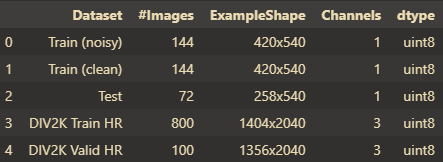
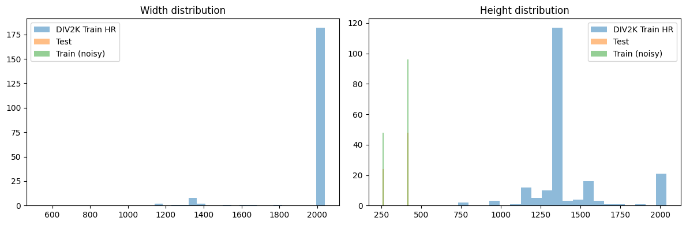
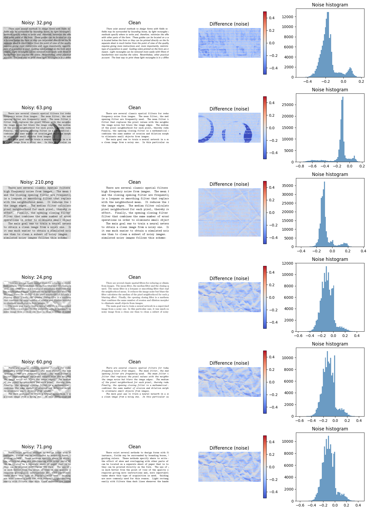
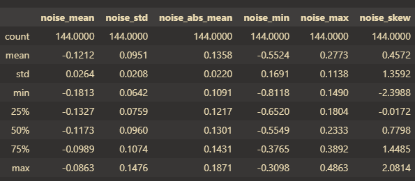
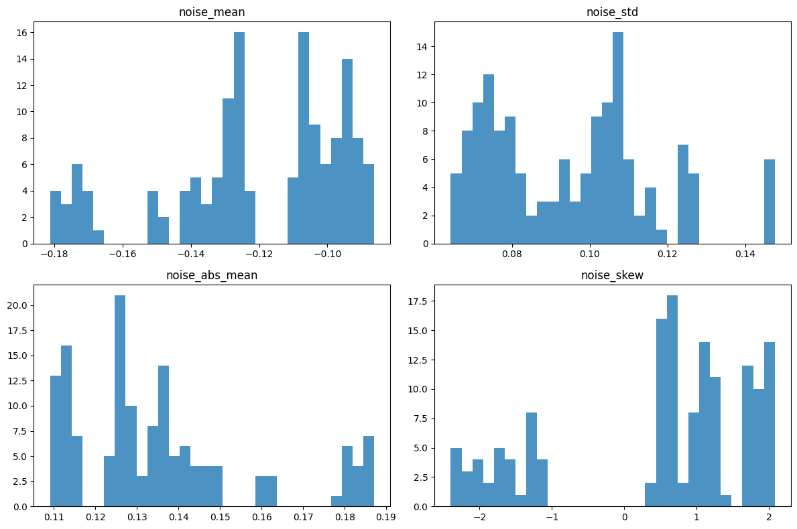
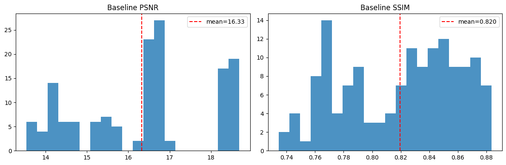
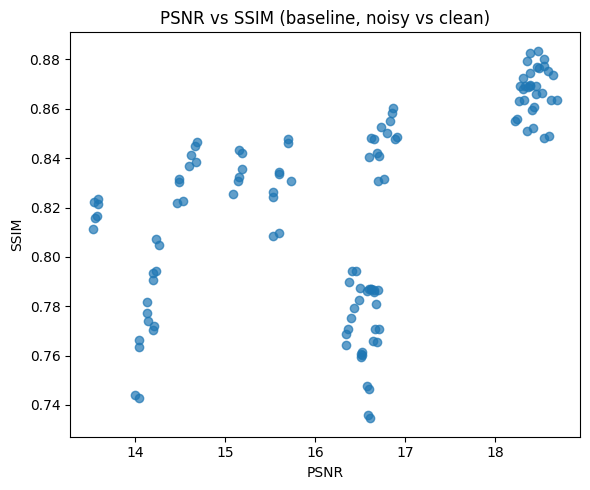
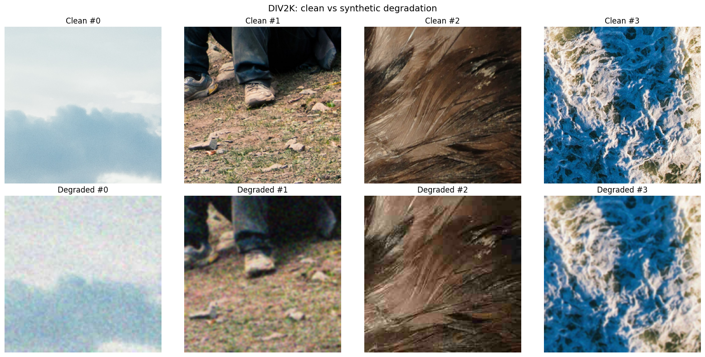

# Creative CV — Denoising Autoencoder для очищення старих та зашумлених фотографій

[](https://python.org)
[](https://pytorch.org)
[](https://streamlit.io)

## Зміст

- [Опис проєкту](#опис-проєкту)
- [Структура проєкту](#структура-проєкту)
- [Вимоги](#вимоги)
- [Встановлення та налаштування](#встановлення-та-налаштування)
- [Датасети](#датасети)
- [EDA (Exploratory Data Analysis)](#eda-exploratory-data-analysis)
- [Моделі](#моделі)
- [Запуск навчання](#запуск-навчання)
- [Запуск інференсу](#запуск-інференсу)
- [Streamlit-додаток (демо)](#streamlit-додаток-демо)
- [Залежності](#залежності)
- [Метрики оцінки](#метрики-оцінки)
- [Команда](#команда)
- [Посилання](#посилання)

---

## Опис проєкту

Проєкт присвячений розробці інтелектуальної системи реставрації старих та зашумлених фотографій з використанням глибокого навчання. Система навчається відновлювати чистий сигнал із зашумленої версії зображення, зберігаючи автентичність та деталі оригіналу.

Реалізовано три архітектури нейронних мереж:
- **CDAE** (Convolutional Denoising Autoencoder)
- **DnCNN** (Denoising Convolutional Neural Network)
- **U-Net** (Compact U-Net з skip-connections)

Для навчання використовується конвеєр синтетичної деградації (Gaussian noise, blur, JPEG-артефакти, downscale) та реальні пари noisy/clean зображень.

---

## Структура проєкту

```
uni_cv/
├── main_new.ipynb           # Основний notebook: EDA, навчання, інференс
├── main.ipynb               # Попередній notebook (архівний)
├── pyproject.toml           # Конфігурація проєкту та залежності (uv)
├── REPORT.md                # Проміжний звіт з проєкту
├── README.md                # Цей файл
├── checkpoints/             # Збережені ваги моделей
│   ├── cdae/
│   │   └── best.pt          # Найкращий чекпоінт CDAE
│   ├── dncnn/
│   │   └── best.pt          # Найкращий чекпоінт DnCNN
│   └── unet/
│       └── best.pt          # Найкращий чекпоінт U-Net
├── data/                    # Дані (не включені в репозиторій)
│   ├── denoising-dirty-documents/
│   │   ├── train/           # Зашумлені зображення (144 шт.)
│   │   ├── train_cleaned/   # Чисті зображення — target (144 шт.)
│   │   ├── test/            # Тестовий набір (72 шт.)
│   │   └── sampleSubmission.csv/
│   └── div2k-dataset/
│       ├── DIV2K_train_HR/  # 800 HR-зображень для навчання
│       └── DIV2K_valid_HR/  # 100 HR-зображень для валідації
└── frontend/
    ├── app_streamlit.py     # Streamlit веб-додаток (демо)
    └── README.md            # Інструкції для фронтенду
```

---

## Вимоги

- **Python** ≥ 3.14
- **CUDA** ≥ 13.0 (рекомендовано для GPU-навчання)
- **GPU**: NVIDIA з ≥ 6 GB VRAM (навчання); CPU достатньо для інференсу
- **ОС**: Linux (протестовано), Windows (підтримується)
- **Дисковий простір**: ~5 GB (дані) + ~100 MB (чекпоінти)

---

## Встановлення та налаштування

```bash
# Встановлення uv (якщо не встановлено)
curl -LsSf https://astral.sh/uv/install.sh | sh

# Перехід до проєкту та синхронізація залежностей
uv sync
```

---

## Датасети

### 1. Denoising Dirty Documents (Kaggle)

Датасет із реальними парами «зашумлений документ / чистий документ» (grayscale, ~420×540 px).

**Завантаження:**
```bash
# Через Kaggle API
kaggle competitions download -c denoising-dirty-documents
```
Або вручну: [https://www.kaggle.com/c/denoising-dirty-documents/data](https://www.kaggle.com/c/denoising-dirty-documents/data)

Розмістити архів `denoising-dirty-documents.zip` у кореневій папці проєкту.

### 2. DIV2K

800 HR-зображень для навчання + 100 для валідації (RGB, ~2040×1356 px).

**Завантаження:**
```bash
curl -L -o div2k-dataset.zip \
  https://www.kaggle.com/api/v1/datasets/download/joe1995/div2k-dataset
```

Розмістити архів `div2k-dataset.zip` у кореневій папці проєкту.

### Автоматична розархівація

Notebook автоматично розпаковує архіви при першому запуску та нормалізує структуру папок (рекурсивно розпаковує вкладені `.zip`, усуває дубльовані вкладеності типу `test/test/`).

---

## EDA (Exploratory Data Analysis)

### Огляд структури датасетів



### Розподіл розмірів зображень



### Пари noisy / clean та карта шуму



### Розподіл інтенсивності пікселів


### Статистика шуму по зображеннях




### Baseline PSNR / SSIM




### Кореляція PSNR-SSIM



### Синтетична деградація (DIV2K)



---

## Моделі

### CDAE (Convolutional Denoising Autoencoder)

- **Архітектура**: Encoder (2 conv blocks + MaxPool) → Bottleneck → Decoder (ConvTranspose2d + conv blocks)
- **Особливість**: Residual head — вихід = input + learned_residual
- **Параметр**: `base` — ширина першого шару (за замовчуванням 32)

### DnCNN (Denoising CNN)

- **Архітектура**: Послідовність Conv2d + BatchNorm + ReLU шарів
- **Особливість**: Residual learning — мережа передбачає шум, який віднімається від входу
- **Параметри**: `depth` (кількість шарів), `width` (кількість фільтрів)

### U-Net (Compact)

- **Архітектура**: Encoder-decoder зі skip-connections (конкатенація)
- **Особливість**: Збереження дрібних текстур через пряме з'єднання encoder→decoder
- **Параметр**: `base` — ширина першого шару (за замовчуванням 32)

Усі моделі мають уніфікований інтерфейс:
```python
from main_new import build_model
model = build_model("cdae", in_channels=1)  # або "dncnn", "unet"
```

---

## Запуск навчання

Навчання виконується через основний notebook `main_new.ipynb`.

### Послідовність комірок:

1. **Imports + device check** — імпорт бібліотек, перевірка CUDA
2. **Archive extraction** — розпакування даних
3. **Path constants** — визначення шляхів
4. **Dataset config + classes** — конфігурація та класи датасетів
5. **Dataset instantiation + DataLoaders** — `DIV2KDegradedDataset`, `DenoisingDataset`, `ConcatDataset`
6. **Smoke test** — перевірка коректності батчів
7. **EDA** — повний аналіз даних (12 секцій)
8. **Model definitions** — CDAE, DnCNN, U-Net
9. **Training API** — `train_one_epoch`, `validate_one_epoch`, `run_training`
10. **Optuna HPO + Final Training** — пошук гіперпараметрів + фінальне навчання
11. **Inference & Comparison** — завантаження чекпоінтів, порівняння моделей

### Ключові параметри навчання

| Параметр | Значення |
|---|---|
| Patch size | 256×256 |
| Batch size | 8 |
| Loss | SmoothL1Loss (beta підбирається Optuna) |
| Optimizer | AdamW |
| Scheduler | ReduceLROnPlateau |
| Gradient clipping | max_norm=5.0 |
| Optuna trials | 15 per model |
| Final epochs | до 30 (early stopping, patience=10) |

### Чекпоінти

Чекпоінти зберігаються автоматично в `checkpoints/<model_name>/best.pt` і містять:
- `state_dict` — ваги моделі
- `in_channels` — кількість вхідних каналів
- `best_val_loss` — найкращий val loss
- `best_params` — оптимальні гіперпараметри (Optuna)
- `history` — повна історія навчання

---

## Запуск інференсу

В notebook (комірка Inference & Comparison):

```python
# Завантаження найкращої моделі
model, ckpt_path = load_best_model("unet", in_channels=1)

# Інференс на батчі
batch = next(iter(val_loader))
result = evaluate_batch(model, batch)
print(f"PSNR: {result['psnr']:.2f} dB, SSIM: {result['ssim']:.4f}")
```

---

## Streamlit-додаток (демо)

### Запуск

```bash
cd frontend
uv run streamlit run app_streamlit.py
```

### Функціональність

- **Завантаження** — завантажити фото та обрати модель (CDAE / DnCNN / U-Net) для відновлення
- **Порівняння** — побачити результати всіх трьох моделей поруч
- **Про проєкт** — інформація про проєкт та використані підходи

---

## Команда

| Учасник | Курс | Спеціальність |
|---|---|---|
| Шандрик Андрій | 4 курс | Інженерія програмного забезпечення |
| Тугай Анастасія | 4 курс | Інженерія програмного забезпечення |
| Швачка Денис | 4 курс | Інженерія програмного забезпечення |

---

## Посилання

- [Denoising Dirty Documents (Kaggle)](https://www.kaggle.com/c/denoising-dirty-documents/data)
- [DIV2K Dataset](https://data.vision.ee.ethz.ch/cvl/DIV2K/)
- [SIDD — Smartphone Image Denoising Dataset](https://www.eecs.yorku.ca/~kamel/sidd/)
- [Image Restoration Using Very Deep CNN with Symmetric Skip Connections](https://arxiv.org/abs/1603.09056)
- [Preserving Old Memories: Human-Interactive Photo Restoration](https://arxiv.org/html/2410.09529v1)
- [Image Denoising by AutoEncoder](https://users.cecs.anu.edu.au/~Tom.Gedeon/conf/ABCs2018/paper/ABCs2018_paper_20.pdf)
- [Autoencoders in Machine Learning](https://www.geeksforgeeks.org/machine-learning/auto-encoders/)
